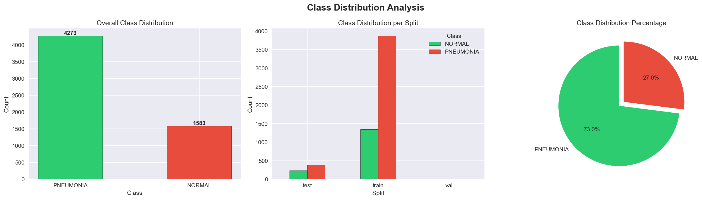
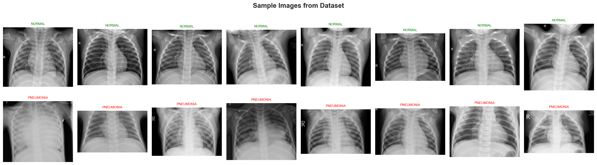
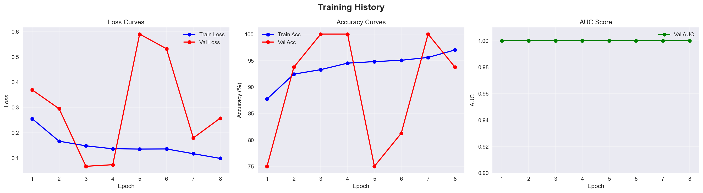
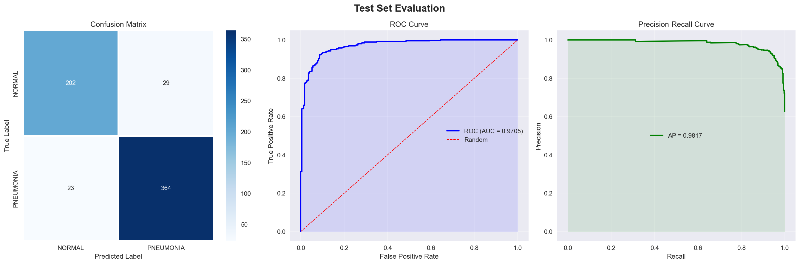

# 🫁 Chest X-Ray Pneumonia Detection


An end-to-end **production-ready** Medical AI system that detects pneumonia
from chest X-ray images using deep learning.

---

## 🎯 Results

| Metric | Score |
|--------|-------|
| Test Accuracy | **93.37%** |
| AUC-ROC | **0.9705** |
| Average Precision | **0.9817** |
| Pneumonia Recall | **94.1%** |
| Normal Recall | **87.4%** |

---

## 🏗️ Project Architecture
```
chest-xray-diagnosis/
│
├── data/
│   ├── raw/                  # Original dataset
│   └── processed/            # Cleaned CSV files
│
├── notebooks/
│   ├── 01_EDA.ipynb          # Exploratory Data Analysis (17 cells)
│   ├── 02_Preprocessing.ipynb # Data pipeline
│   └── 03_Model_Training.ipynb # Training + Evaluation
│
├── api/
│   ├── main.py               # FastAPI backend
│   └── schemas.py            # Pydantic schemas
│
├── frontend/
│   └── app.py                # Streamlit UI
│
├── experiments/
│   ├── best_model.pth        # Trained model weights
│   └── mlruns/               # MLflow experiment logs
│
├── configs/
│   ├── class_weights.json    # Imbalance handling
│   └── preprocessing_config.yaml
│
├── reports/
│   └── figures/              # All EDA & evaluation plots
│
├── requirements.txt
├── Dockerfile
└── README.md
```

---

## 🔬 Methodology

### 1. Exploratory Data Analysis
- Dataset: 5,856 chest X-ray images (NORMAL vs PNEUMONIA)
- Detected & removed **32 duplicate images**
- Analyzed class imbalance (73% PNEUMONIA vs 27% NORMAL)
- Image size analysis, pixel intensity distribution
- t-SNE & PCA feature visualization
- CLAHE & edge detection analysis

### 2. Preprocessing Pipeline
- Resize all images to **224×224**
- **CLAHE** contrast enhancement (medical imaging standard)
- ImageNet normalization (mean/std)
- **WeightedRandomSampler** for class balancing

### 3. Data Augmentation
- Horizontal Flip (p=0.5)
- Rotation ±15° (p=0.5)
- Brightness/Contrast (p=0.5)
- Elastic Transform (p=0.2) — medical imaging specific
- Coarse Dropout (p=0.3)

### 4. Model Architecture
- **EfficientNetB0** pretrained on ImageNet
- Custom classifier head with dropout (0.3)
- **Mixed Precision Training** (FP16) for memory efficiency
- **WeightedCrossEntropyLoss** for class imbalance

### 5. Training Strategy
- Optimizer: Adam (lr=0.001, weight_decay=1e-4)
- Scheduler: ReduceLROnPlateau (factor=0.5, patience=3)
- Early Stopping (patience=5)
- MLflow experiment tracking

### 6. Explainability
- **Grad-CAM** visualization showing model attention regions
- Model focuses on correct lung regions ✅

---

## 🚀 Quick Start

### Prerequisites
- Python 3.10
- CUDA-capable GPU (optional)
- Miniconda/Anaconda

### Installation
```bash
# Clone repository
git clone https://github.com/PRASHANTRATHAUR/chest-xray-pneumonia-detection.git
cd chest-xray-pneumonia-detection

# Create environment
conda create -n medical-ai python=3.10
conda activate medical-ai

# Install PyTorch with CUDA
pip install torch torchvision --index-url https://download.pytorch.org/whl/cu118

# Install dependencies
pip install -r requirements.txt
```

### Run the Application
```bash
# Terminal 1: Start API
uvicorn api.main:app --host 0.0.0.0 --port 8000

# Terminal 2: Start Frontend
streamlit run frontend/app.py
```

Open **http://localhost:8501** in your browser.

### API Usage
```bash
# Health check
curl http://localhost:8000/health

# Predict from image
curl -X POST "http://localhost:8000/predict" \
  -H "Content-Type: multipart/form-data" \
  -F "file=@chest_xray.jpg"
```

**Response:**
```json
{
  "prediction": "PNEUMONIA",
  "confidence": 0.9993,
  "probabilities": {
    "NORMAL": 0.0007,
    "PNEUMONIA": 0.9993
  },
  "inference_time_ms": 1063.79,
  "status": "success"
}
```

---

## 📊 Key Visualizations

### Class Distribution


### Sample Images


### Training Curves


### Confusion Matrix & ROC Curve


### Grad-CAM Explainability


---

## 🛠️ Tech Stack

| Component | Technology |
|-----------|-----------|
| Deep Learning | PyTorch 2.7 |
| Model | EfficientNetB0 |
| Augmentation | Albumentations |
| API | FastAPI |
| Frontend | Streamlit |
| Experiment Tracking | MLflow |
| Image Processing | OpenCV |
| Containerization | Docker |

---

## 📁 Dataset

**Chest X-Ray Images (Pneumonia)** by Paul Mooney
- Source: [Kaggle](https://www.kaggle.com/datasets/paultimothymooney/chest-xray-pneumonia)
- Total: 5,856 images
- Classes: NORMAL (1,583) | PNEUMONIA (4,273)
- Split: Train/Test/Val

---

## 🔑 Key Features

- ✅ End-to-end ML pipeline (EDA → Training → Deployment)
- ✅ Production-ready FastAPI REST API
- ✅ Interactive Streamlit web interface
- ✅ Grad-CAM explainability
- ✅ MLflow experiment tracking
- ✅ Mixed precision training
- ✅ Class imbalance handling
- ✅ Medical-specific preprocessing (CLAHE)
- ✅ Docker containerization
- ✅ Comprehensive EDA (17 analyses)

---

## 👨‍💻 Author

**Prashant Rathaur** — Machine Learning Engineer

[](https://github.com/PRASHANTRATHAUR)

---

## ⚠️ Disclaimer

This project is for **educational purposes only**.
Not intended for clinical use.
Always consult a qualified medical professional.

---

## 📄 License

MIT License — feel free to use and modify!